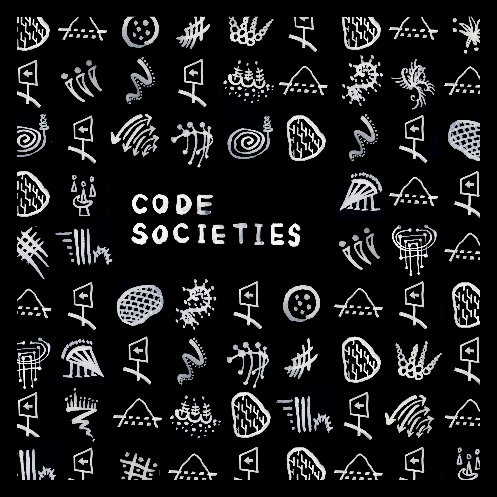

# Code Societies Summer 2018

- 3 Week Session, Monday July 1st - Saturday July 21st
- @ SFPC, 155 Bank street, West Village, NYC
- 6:30pm - 9:30pm, Monday to Friday

#### Description
Code Societies will examine the ideological and mythological attributes of
computation, concentrating on the poetics and politics of culturally embedded
software. How do different platforms and processes — including algorithms, data
collection, social media, networks, simulation, and ritual — yield distinct
modes of seeing, thinking, and feeling, structure social organization, and
reinforce existing systems of power? Through a balanced study of critical theory
and hands-on making workshops, students will create several small projects that
explore and question these ideas. Students will be introduced to Python and
discover poetic, playful, and powerful ways to use computation. All levels of
programming ability welcome and an enthusiastic willingness to reconsider how
code shapes and is shaped by society required!

Code Societies Summer 2018 session is organized by Melanie Hoff and the teaching
assistant is Ying Quan Tan.

# Teachers

- Allison Parrish
- American Artist
- danah boyd
- Dan Taeyoung
- Lauren McCarthy
- Melanie Hoff
- Sarah Aoun
- Shannon Mattern
- Taeyoon Choi

# Classes

### Smarter Home
Lauren McCarthy
- July 3rd, 10th
- https://github.com/lmccart/Smarter-Home

We will explore home as a place, as an identity, as a practice, and as a series
of rituals. What makes someone feel "at home" in a space or in a community (both
in person and online)? We will investigate the meaning of home as private space.
What happens when networked technologies are brought into this? What roles do
surveillance, data collection, automation, and telepresence play? But what is
our ideal home of the future? As a class, we will build a smart home on our
terms, with each person contributing a device, gesture, piece of furniture,
ritual, etc of their design to create an installation throughout sfpc's space.

### Hacking the Attention Economy, Amplifying Discord and Hate
danah boyd
- July 5th

### Authoring text under control: from automatic writing to autocomplete
Allison Parrish
- July 6th, 9th, 18th
- https://gist.github.com/aparrish/84067a801d840ceef190053cec1266e7

"Automatic writing" refers to a process in which an author produces writing
effortlessly, without apparent conscious awareness. Psychologists study
automatic writing to better understand how mind affects muscle; creative writers
use it to circumvent writer's block; surrealists practice it to recover a
repressed primal consciousness; spiritualists use it to communicate with the
dead. This series of workshops attempts to make explicit the technical and
conceptual connections between these varied practices and computer-generated
text, considering technologies like spell check, autocomplete, and search
suggestions to themselves qualify as ""automatic writing."" Using the Python
programming language, students will learn a series of techniques for producing
text ""automatically"" with computer programs and design interfaces for
""writing"" with these programs. We'll discuss the nature of text and authorship
in a future where technology increasingly mediates the act of writing itself.

Sessions will combine brief lectures with seminar-format discussions alongside
tech tutorials. We'll also set aside some time for workshopping of student work
as needed.

### Diversity & Inclusion in Surveillance AI
Sarah Aoun
- July 11th
- https://gist.github.com/saoun/5465ce56b684f463d136ba0e863c3cf8

Facial recognition and diversity have not gone together seamlessly. On the one
hand, despite the popular rise of facial recognition technology over the past
several years, we have witnessed the exclusion of people of color from the
design and implementation process. Facial recognition tools are often
discriminatory, and time after time, softwares either fail to recognize people
of color or mislabel them. On the other hand, facial recognition technology is
also one that is increasingly integrated into police and state surveillance
tools. Addressing these tensions, this class will explore tools of surveillance
and whom they target, the social and political implications of AI development,
and the unintended effects that diversity and inclusion might have.

### Software as Ideology
American Artist
- July 12th
- https://github.com/0ld-h3ad/SFPC-code-societies

Expanding on Wendy Hui Kyong Chun’s theory of software as an analogy for
ideology, we will look in depth at Alexander Galloway’s take on the idea, which
contrasts a historical overview of ideology with a contemporary description of
software, to reveal where these two interfacing methods of society overlap. We
will discuss how software became distinct from hardware, the presumption of
programmers as different from users, and how obfuscation is an essential tool of
software development as well as ideology.

### Social Network Paintings
Melanie Hoff & Dan Taeyoung
- July 13th
- https://github.com/smalldatasquad/social-network-paintings

What is the self-portrait of a society?

On social media, you are an individual who forms relationships with other individuals. You follow, link, like, subscribe. 
A model of a social network understands society as a series of interconnected networks, graphs, spider webs. Individuals are circular nodes, relationships are lines or edges, and networks are portrayed as linkages between nodes. With a social network, the data is the message: both a visual representation, and a database structure.
Embedded in this node-and-edge paradigm is an underlying presumption that humans are individuals first, and that society, groups, and cultures then arise as result of individual groupings: That society is, supposedly, *what emerges when you connect a group of individuals.*

But is this really the case? We pay attention to what our closest friends pay attention to. We adopt the habits of our loved ones. We are affected by people, forces, and ecologies we’ve never known. We are beings formed by our societies, our systems, our cultures. 

Social Network Paintings is an exploration of the most common representations of social networks and the ways the database as form has influenced these representations. We will get our hands dirty with paint and software to make and remake social networks and societies. What are the conceptual assumptions and gaps in the network-form? How can these forms be misused, reappropriated, and decontextualized to represent other modes of experience? How can painting, poetry, and performance be a models for representing our societies?

### Sorting Things Out: Classifications, Ontologies, Data Models, Knowledge Graphs
Shannon Mattern
- July 16th, 17th
- https://docs.google.com/document/d/1riZTAquDnjMzM_gHm3gZobxnuitBwAEXaX68AhLTKNY/edit?usp=sharing

We sort things into piles, put things onto shelves, build folders on desktops,
and check boxes on forms that identify (or approximate) our gender, race, and,
citizenship. Such sorting not only helps to reduce clutter; it also, often,
determines what counts, imposes an implied valuation, and informs access to
opportunity. In these two sessions of “Code Societies,” we’ll examine how the
construction of classification systems, ontologies, data models, and knowledge
graphs serves to translate between worldviews, way of knowing, ideologies, and
modes of governance. In some cases, we might say that these organizational
systems, encoded in computational form, code particular societies into being.
How might we develop aspirational ontologies that help us to imagine more just,
inclusive, peaceful societies?

### Distributed Web of Care
Taeyoon Choi
- July 18th
- https://github.com/tchoi8/distributedwebofcare/tree/codesocieties

Distributed Web of Care is an initiative to code to care and code carefully. In
this class, we will investigate centralized, decentralized, distributed and peer
to peer networks. We will analyze the popular platforms such as Instagram and
technical platforms such as GitHub, focusing on the network structure and
protocols. We will experiment with strings and stickers to visualize and embody
different types of network. We will imagine the kinds of network we want for the
future and we will discuss how we can build it with code and code of conduct. We
will distribute our work (poetry, code, or something else) over distributed
network using Beaker browser.
